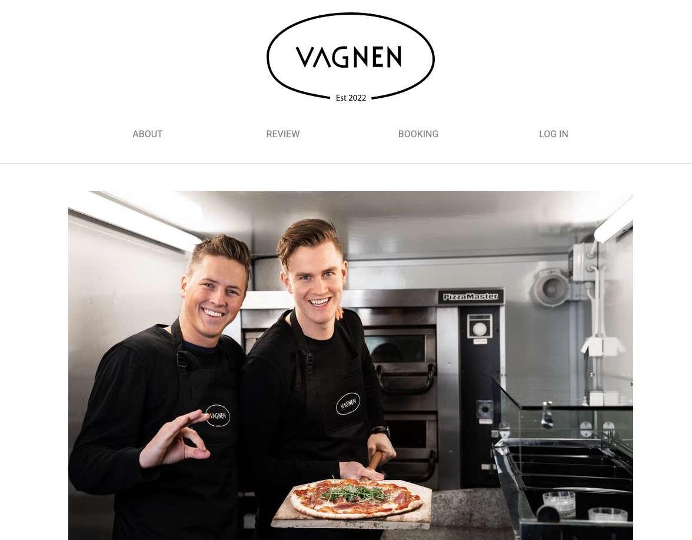
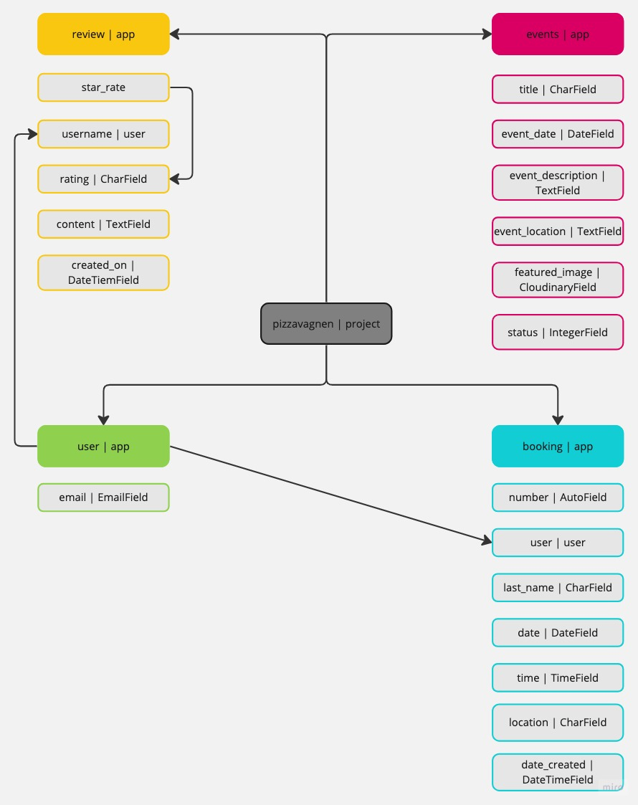
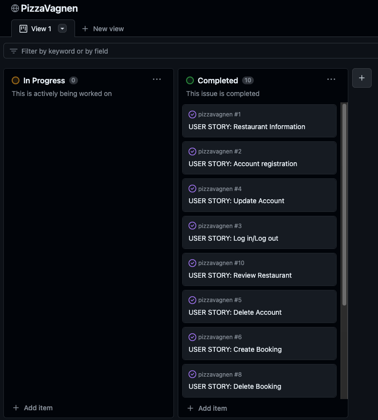

# The Pizza Truck

**Deployed website: [Link to website](https://pizzavagnen-eb78667e7b70.herokuapp.com/)**

## About

The Pizza Truck is a swedish food truck serving delicious pizza slices on your private 50th birthday party, on your corporate event or on your festival.
The pizza truck is on wheels so we go wherever you want us to be. On this website you are able to book the truck for your event and leave a review if you have had a visit!

---

## Business Model

The Business Model is B2C, meaning that the company sells products to customers only.
It focuses on individual transactions only.

---

## UX

I wanted the website to be minimalistic and for the user to easy navigate around the page to make it user friendly. I also wanted as few pages impossible so i've worked a lot with modals. The website is responsive over all plattforms.

### Target Audience

This website is intended for people who wants to serve food on their event, both private and corporate.

---

### User Stories

| Issue ID    | User Story |
|-------------|-------------|
| [#1](https://github.com/simonjellvert/pizzavagnen/issues/1) | As a user I can read about the restaurant so that I know what kind of food and services they provide their customers |
| [#2](https://github.com/simonjellvert/pizzavagnen/issues/2) |
As a user I can register an account so that I can book PizzaVagnen to my event |
| [#3](https://github.com/simonjellvert/pizzavagnen/issues/3) | As a user I can log in and log out so that I can manage my bookings |
| [#4](https://github.com/simonjellvert/pizzavagnen/issues/4) | As a user I want to be able to change my e-mail address and password |
| [#5](https://github.com/simonjellvert/pizzavagnen/issues/5) | As a user I want to be able to delete my account |
| [#6](https://github.com/simonjellvert/pizzavagnen/issues/6) | As a user I can add a booking to my event |
| [#7](https://github.com/simonjellvert/pizzavagnen/issues/7) | As a user I can update my booking if needed |
| [#8](https://github.com/simonjellvert/pizzavagnen/issues/8) | As a user I can delete my booking if I want hamburgers or something else or anything at all instead. |
| [#9](https://github.com/simonjellvert/pizzavagnen/issues/9) | As a site admin I can manage bookings and events so that I can apporove bookings and add/delete events |
| [#10](https://github.com/simonjellvert/pizzavagnen/issues/10) | As a user I can leave a review so that I can tell what I think about the restaurant |

---

## Technologies used

- ### Languages

  - Python3.9.17: the primary language used to develop the server-side of the website.
  - JS: used to serve bootstrap functions
  - HTML: the markup language used to create the website.
  - CSS: the styling language used to style the website.
  - Bootstrap: for additional styling

- ### Frameworks and libraries

  - Django: python framework used to create all the logic.

- ### Databases

  - ElephantSQL: the database used to store all the data.
  
- ### Other tools

  - Cloudinary: to host images.
  - Git: the version control system used to manage the code.
  - Pip3: the package manager used to install the dependencies.
  - Gunicorn: the web server used to run the website.
  - Psycopg2: the database driver used to connect to the database.
  - GitHub: used to host the website's source code.
  - CodeAnywhere: the IDE used to develop the website.
  - Chrome DevTools: was used to debug the website.
  - Font Awesome: was used to create the icons used in the website.
  - Miro: was used to make a flowchart for the README file.
  - [W3C Validator](https://validator.w3.org/): was used to validate HTML5 code for the website.
  - [W3C CSS validator](https://jigsaw.w3.org/css-validator/): was used to validate CSS code for the website.
  - [JShint](https://jshint.com/): was used to validate JS code for the website.
  - [PEP8](https://pep8.org/): was used to validate Python code for the website.

### Entity-Relationship Diagram

---

## Features

- ### Existing Features
  
  - Register to whe website using email, username and password
  - Log in th the website using username and password
  - User can create, edit and delete booking
  - User can create, edit and delete reviews
  - User can edit and delete profile
  - Admin can do all of the above and:
  - Admin can create, edit and delete events
  - Admin can view all users bookings

- ### Future Feature Considerations
  
  - Add menu for the user to be able to see what kind of pizza's are being served
  - Pricing table depending on where the event is held, how many people etc.

---

## Design

The website is minimalistic and easy to read navigate.
I kept it clean with understandable colors of buttons, and obvious hovering effects.

### Fonts

I used fonts provided by Google Fonts:
- [Roboto](https://fonts.google.com/specimen/Roboto)
- As back up font, traditional Sans Serif.

### Visual Effects

- Sweep to bottom on navbar links and log out button
- Bootstrap modal for creating, editing and deleting reviews.
- Bootstrap modal for deleting account and booking
- Navbar collapse to dropdown menu on small - medium size screens
- Font Awesome icons for buttons and navigation

## Agile Methodology

### GitHub Project Management

  

GitHub Project Management was used to manage the project.

---

## Deployment

### On Heroku

- Log in to Heroku account.
- Click on "New" button on dashboard.
- Then "Create new app" and follow the steps.
- Link app to GitHub repository in "Deploy" tab.
- Set up config variables in "Settings" tab.
- Click on "Deploy Bransch" in "Deploy" tab.
- Heroku will now deploy the project.

### Local

- Run `python3 manage.py runserver` in the terminal window.

---

## Testing

Please refer to the [TESTING.md](TESTING.md) file for all test-related documentation.

---

## Credits

### Content and Images

- [Pexels](https://www.pexels.com/sv-se/): for providing a free images.
- [Cloudinary](https://cloudinary.com/?&utm_campaign=1329&utm_content=instapagelogocta-selfservetest): for hosting images.
- [Chrome Developer Tools](https://developer.chrome.com/extensions/devtools_inspector): for providing a free platform to test website.
- [Slack](https://slack.com/): and all members for sharing your knowledge.
- PizzaVagnen: for letting me use your brand and business for this project.

---

## Acknowledgments

- My great mentor [Iuliia Konovalova](https://github.com/IuliiaKonovalova) for your assistance on troubleshooting and for being my bug detective!
- [Daniel Stauffer](https://github.com/RebellionWebdesign) for inspirairation on how to set up your similar project.
- [CodeInstitiute](https://codeinstitute.net) for great guidance on how to set up Django project.