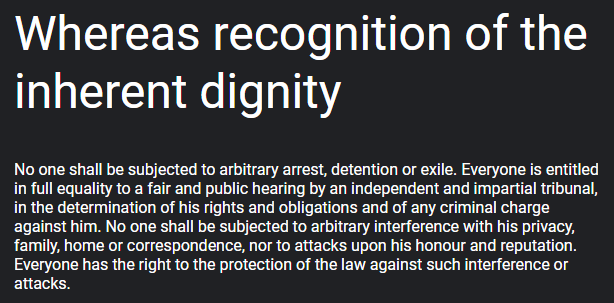
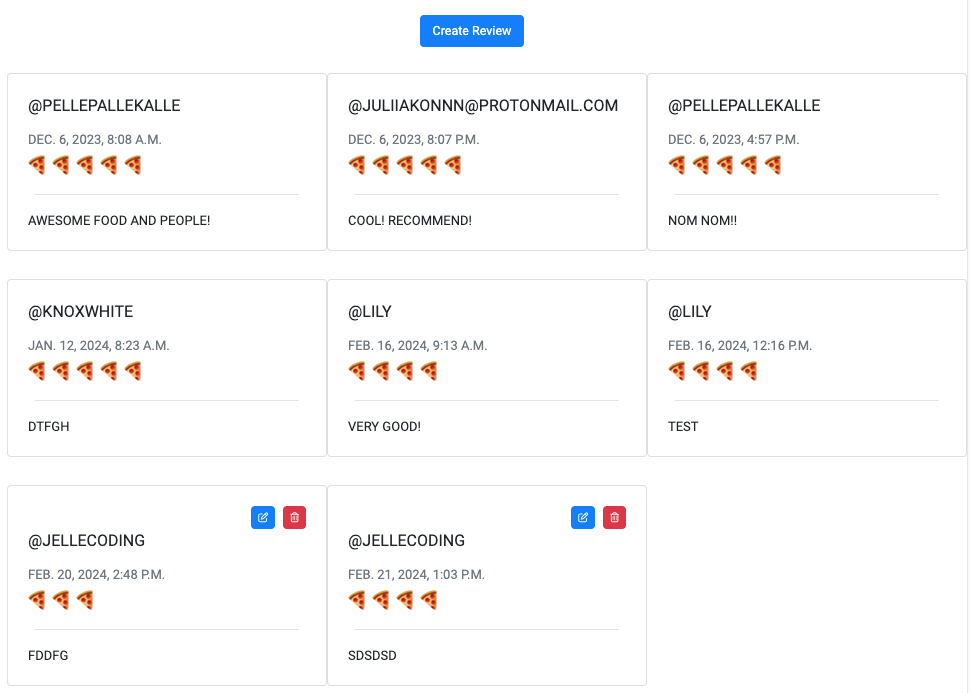

# The Pizza Truck

**Deployed website: [Link to website](https://pizzavagnen-eb78667e7b70.herokuapp.com/)**


## About

The Pizza Truck (translated from the swedish "PizzaVagnen") is a swedish food truck serving delicious pizza slices on your private 50th birthday party, on your corporate event or on your festival.
The pizza truck is on wheels so we go wherever you want us to be. On this website you are able to book the truck for your event and leave a review if you have had a visit!

---

## Business Model

Until this website is deployed and live the PizzaTruck have only been marketing itself on social media platforms. For booking the owners have referred to their phone numbers, leading to plenty of missed potential bookings when they where not able to answer their phones. With this website a potential booking will never be missed again since it is now possible to book the truck directly on your phone or computer.

This is a big step forward for the company and will probably elevate their sellings quickly.

The truck sells their services both B2B and B2C.

---

## UX

I wanted the website to be minimalistic and for the user to easy navigate around the page to make it user friendly. I also wanted as few pages impossible so i've worked a lot with modals. The website is responsive over all plattforms.

### Target Audience

This website is intended for people who wants to serve food on their event, both private and corporate.

---

### User Stories

| Issue ID    | User Story |
|-------------|-------------|
| [#1](https://github.com/simonjellvert/pizzavagnen/issues/1) | As a user I can read about the restaurant so that I know what kind of food and services they provide their customers |
| [#2](https://github.com/simonjellvert/pizzavagnen/issues/2) | As a user I can register an account so that I can book PizzaVagnen to my event |
| [#3](https://github.com/simonjellvert/pizzavagnen/issues/3) | As a user I can log in and log out so that I can manage my bookings |
| [#4](https://github.com/simonjellvert/pizzavagnen/issues/4) | As a user I want to be able to change my e-mail address and password |
| [#5](https://github.com/simonjellvert/pizzavagnen/issues/5) | As a user I want to be able to delete my account |
| [#6](https://github.com/simonjellvert/pizzavagnen/issues/6) | As a user I can add a booking to my event |
| [#7](https://github.com/simonjellvert/pizzavagnen/issues/7) | As a user I can update my booking if needed |
| [#8](https://github.com/simonjellvert/pizzavagnen/issues/8) | As a user I can delete my booking if I want hamburgers or something else or anything at all instead. |
| [#9](https://github.com/simonjellvert/pizzavagnen/issues/9) | As a site admin I can manage bookings and events so that I can apporove bookings and add/delete events |
| [#10](https://github.com/simonjellvert/pizzavagnen/issues/10) | As a user I can leave a review so that I can tell what I think about the restaurant |

---

## Technologies used

- ### Languages

  - Python 3.12.1: the primary language used to develop the server-side of the website.
  - JS: used to serve bootstrap functions
  - HTML: the markup language used to create the website.
  - CSS: the styling language used to style the website.
  - Bootstrap: for additional styling

- ### Frameworks and libraries

  - Django: python framework used to create all the logic.

- ### Databases

  - ElephantSQL: the database used to store all the data.
  
- ### Other tools

  - Cloudinary: to host images.
  - Git: the version control system used to manage the code.
  - Pip3: the package manager used to install the dependencies.
  - Gunicorn: the web server used to run the website.
  - Psycopg2: the database driver used to connect to the database.
  - GitHub: used to host the website's source code.
  - CodeAnywhere: the IDE used to develop the website.
  - Chrome DevTools: was used to debug the website.
  - Font Awesome: was used to create the icons used in the website.
  - Miro: was used to make a flowchart for the README file.
  - W3C Validator: was used to validate HTML5 code for the website.
  - W3C CSS validator: was used to validate CSS code for the website.
  - PEP8: was used to validate Python code for the website.

### Entity-Relationship Diagram


---

## Features

- ### Existing Features
  
  - Register to the website using email, username and password
  - 
  - Log in to the website using username and password
  - 
  - User can alse edit and delete their profile
  - 
  - Booking page
  - 
  - User can create booking
  - 
  - User can edit booking
  - 
  - User can delete booking
  - 
  - Reviews page
  - 
  - User can create review
  - 
  - User can edit review
  - 
  - User can delete reviews
  - 
  - User can edit profile
  - 
  - User can delete profile
  - 
  
  #### Admin can do all of the above and:
  
  - Admin can create events
  - 
  - Admin can edit events
  - 
  - Admin can delete events
  - 
  - Admin can view all users bookings
  - 

- ### Future Feature Considerations
  
  - Add menu for the user to be able to see what kind of pizza's are being served
  - Pricing table depending on where the event is held, how many people etc.
  - Email confirmation of booking

- ## Security features
- The project was secured using Django decorator login_required which is protecting the views to create, edit and delete all apps.
- Additional security was added to the staff_list.html so a regular user cannot access that page. The review page also has additional security to make sure the user only can edit and delete their own reviews.
- The SECRET_KEY is stored inside the env.py file and config vars on Heroku site.
- DATABASE_URL and CLOUDINARY_URL is stored inside the env.py and config vars on Heroku.


---

## Design

When I designed the website, the only requirement from the owners was that it should be easy to navigate and easy to understand. As few clicks as possible to have a booking ready. 
I had a clear picture in my head of how the page would look and started right away without producing any wireframes. The design was coordinated with the owners on an ongoing basis to minimize inaccuracies.

This resulted in a website that is minimalistic and easy to read and navigate.
I kept it clean with understandable colors of buttons, and obvious hovering effects. To make the pages come alive I've added some background images with a little bit of opacity to highlight the relevant parts, which in other case would have been pretty boring to look at.
The review page is creating a feeling of a social network comments section.

### Fonts

I used fonts provided by Google Fonts:
- I choosed **[Roboto](https://fonts.google.com/specimen/Roboto)** because I think it gives a nice touch to the website. It's easy to read and aligns with the minimalistic theme of the website.


- As back up font, traditional **Sans Serif**.

### Colors

The colors I've used is very basic, but gives a good contrast to the backgrounds.
Below is a palette of the colors used, and below that a description of how each color is used.


- #FFFFFF is used as the default background. On some of the pages there's also a background image on top of the default background.
- #007BFF is used for buttons
- #FF0000 is used for buttons
- #DC3545 is the background color of the log out button on the top of the screen
- #25A745 is used for updating profile on user page
- #6DBF9C is the background color of the hover effect on the navbar.
- #000000 is the backgrpund color of the footer and the default text color.

### Background

As the background of sign up, sign in, log out, account, booking and change password pages I've used a background just to make to pages more alive. To the image I added a filter of 0.25 brightness just to enhance the content in the foreground.


### Visual Effects

- Sweep to bottom on navbar links and log out button


- Bootstrap modal for creating, editing and deleting reviews, to create a feeling of a social media platform with the @ tag before the username, and for easy navigation. Pizza slices are used for ratings to make it a little bit more fun to create a review.




- Bootstrap modal for deleting account and booking


- Navbar collapse to dropdown menu on small - medium size screens


---

## Agile Methodology

### GitHub Project Management

  

GitHub Project Management was used to manage the project.

---

## Deployment

### Heroku

To deploy the project to Heroku, I took the following steps.

#### Requirements and Procfile

In order to deploy the project, Heroku needs information about the technologies used. Before deployment, I create a Procfile and a list of requirements. In some cases, you may also need a runtime.txt file specifying the version of Python to use.

* Create a plain file called Procfile without any file suffix, at the root level of the project.
* Type ```web: gunicorn <your_app_name>.wsgi:application``` into the Procfile and save.
* In your IDE terminal, type ```pip3 freeze local > requirements.txt``` to create the requirements.
* (Optional) Create a runtime.txt and type ```python-3.12.1``` (or whichever version you use)
* Commit and push these files to the project repository.

#### Create the Heroku app:

* Sign in or sign up to [Heroku](https://heroku.com/).
* Click the button that says "Create new app."
* Enter a unique app name.
* Choose your region from the dropdown menu.
* Click the "Create app" button.

#### Heroku Settings:

For Heroku to be able to process and render the project, you must define some environment variables.
Deploying the project without these is like trying to start a car without the key.

* Go to the settings page of your new app
* Scroll down and open the Config Vars
* Add a DATABASE_URL variable and assign it a link to your database
* Add a SECRET_KEY variable and assign it a secret key of your choice
* Add a CLOUDINARY_URL variable and assign it a link to your Cloudinary

#### Project Settings:

It's important that the environment variables and settings in the django project are compatible with the settings on Heroku. These are the steps to ensure a proper setup.

* Include ```https://<your_app_name>.herokuapp.com``` in the ALLOWED_HOSTS and CSRF_TRUSTED_ORIGINS lists inside the settings.py file.
* Make sure that the environment variables (DATABASE_URL, SECRET_KEY, and CLOUDINARY_URL) are correctly set to ```os.environ.get("<variable_name>")```
* If making changes to static files or apps, make sure to run collectstatic or migrate as needed.
* Commit and push to the repository.

#### Connect the repository:

Once your Heroku settings and GitHub repository are up to date, it's time to connect the two.

* Go to the Deploy tab of your Heroku app.
* Find the "Deployment method" section and click GitHub.
* Type in the name of your repository to search for it
* Click 'Connect' to connect the repository
* (Optional) Enable automatic deployment to automatically update the Heroku app whenever you push to GitHub

#### Deploy the project to Heroku:

Now, all that's left to do is to deploy and open the app.

* Click "Deploy branch"
* Wait for Heroku to finish building the app.
* Upon successful deployment, click the "View" button to open the app.

---

## Testing

Please refer to the [TESTING.md](TESTING.md) file for all test-related documentation.

### Bugs
During the development of this project I've had lots of bugs to deal with. Unfortunately I've been working on two different computers (my private computer and the company computer), the documentation of relevant bugs was stored on the company computer wich I'm not longer have access to. 

#### Solved bugd
From top of mind here is a list of relevant bugs that is solved:
- I had issues making the pizza slices (rating) in the review working properly. Debugged it with my mentor (who had made a similar rating structure in her project).
- The booking app was raising an error when trying to submit the form since the input for time was missing. The user could not enter time and therefor the form submission failed.
- I've had lots of issues with modals not prepopulating the form fields correctly.
- There where also a lot of issues creating the events views since I wanted backend to raise errors that it's not possible to add event in the past or when the truck is booked.

#### Unsolved bugs
- Bootstrap modals not centered on screen
- Cannot use the default image on the add event form

---

## Credits

### Content and Images

- [Pexels](https://www.pexels.com/sv-se/): for providing a free images.
- [Cloudinary](https://cloudinary.com/?&utm_campaign=1329&utm_content=instapagelogocta-selfservetest): for hosting images.
- [Chrome Developer Tools](https://developer.chrome.com/extensions/devtools_inspector): for providing a free platform to test website.
- [Slack](https://slack.com/): and all members for sharing your knowledge.
- PizzaVagnen: for letting me use your brand and business for this project.

---

## Acknowledgments

- My great mentor [Iuliia Konovalova](https://github.com/IuliiaKonovalova) for your assistance on troubleshooting and for being my bug detective!
- [Daniel Stauffer](https://github.com/RebellionWebdesign) for inspirairation on how to set up your similar project.
- [CodeInstitiute](https://codeinstitute.net) for great guidance on how to set up Django project.
