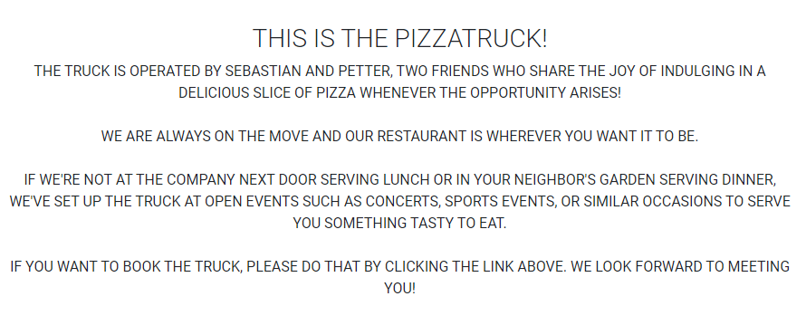
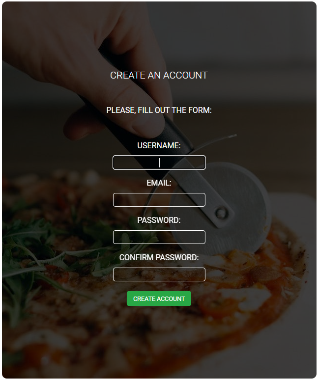
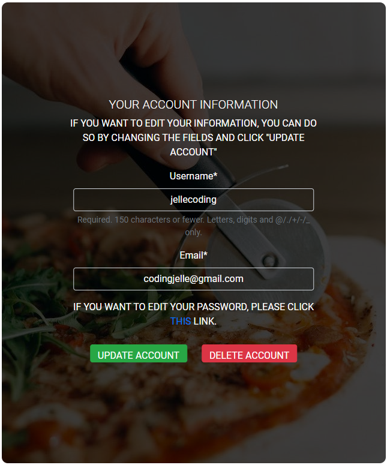
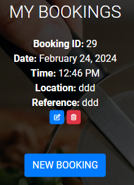
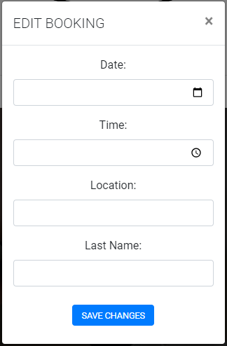
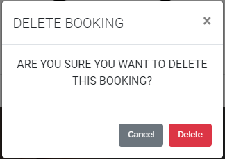
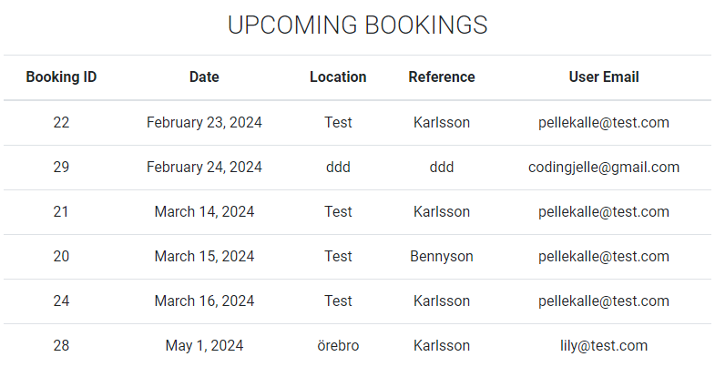
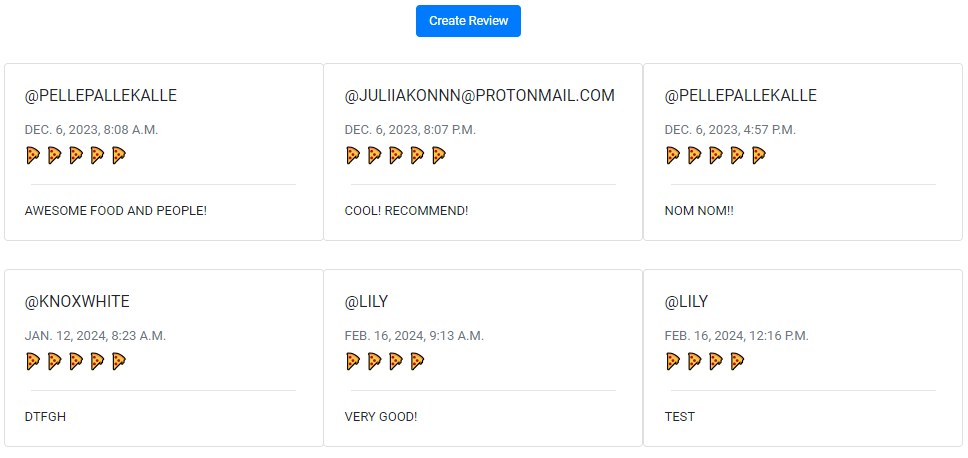

# TESTING

## MANUAL TESTING

Manual tests were made by myself, friends, co-workers and the owners of the Pizza Truck.

|             FEATURE              |               ACTION               |               EXPECTED RESULT               | TESTED | PASSED |
| :------------------------------: | :--------------------------------: | :-----------------------------------------: | :----: | :----: |
|    Navigation: collapse   |         click icon         |       opens navigation        |  YES   |        YES        |
|     Navigation: logo link     |         click logo         |       sends to homepage       |  YES   |        YES        |
|    Navigation: responsive     |       resize window        |   navigation scales smaller   |  YES   |        YES        |
|   Navigation: hover effects   |    hover over the links    |      links change color       |  YES   |        YES        |
|   Navigation: anchor links    | click links |    redirect to page    |  YES   |        YES        |
|  Navigation: user navigation  |           login            |    login form appears    |  YES   |        YES        |
|   Navigation: logout button    |           when logged in           |   button appears top right corner    |  YES   |        YES        |
| Navigation: close button | click | closes navigation | YES | YES |
| Homepage: sign up button | click | sends to sign up page | YES | YES |
| Homepage: log in button | click | sends to log in page | YES | YES |
| Homepage: social icons | click | sends to respective site | YES | YES |
| Profile: edit info | click | profile is updated | YES | YES |
| Profile: delete account | click | profile is deleted | YES | YES |
|    Profile: change password link     |           click            |       sends to chang password page       |  YES   | YES |
| Review: new review button | click | opens new review modal | YES | YES |
| Review: delete review button | click | opens delete modal | YES | YES |
| Review: edit review button | click | opens edit modal | YES | YES |
| Booking: new booking button | click | sends to new booking page | YES | YES |
| Booking: delete booking button | click | opens delete booking modal | YES | YES |
| Booking: edit booking button | click | opens edit booking modal | YES | YES |
| Booking: save booking button  |           click            |         saves booking, redirected to booking         |  YES   |        YES        |
| Booking: date picker |         pick date          |         date can not be in the past         |  YES   |        YES        |
| Booking: paginate | -- | if more than two bookings | YES | YES |
| Booking: made by other users | -- | should not be displayed | YES | YES |
| Booking (admin): staff: view bookings | click | should display all bookings in table | YES | YES |
| About (admin): add event | click | should open modal for entering event info | YES | YES |
| About (admin): invalid form | click add | should not save event and give error message | YES | YES |
| About (admin): valid form | click add | should save form and display success message | YES | YES |
| About (admin): edit event | click | should open modal | YES | YES |
| About (admin): invalid form | click add | should not save event and raise error message | YES | YES |
| About (admin): valid form | click add | should save event and display success message | YES | YES |
| About (admin): delete event | click delete | should open delete modal | YES | YES |
| About (admin): delete event | click delete | should delete the event and raise error message | YES | YES |
| Buttons: Hover effects | hover over buttons | button changes color | YES | Partly, would like to edit some |
| Messages | if success, info, warning or error | should be displayed on screen | YES | YES |

## Testing User Stories

| ID | User Story (link to GitHub issue)  | Requirement met Y/N    | Image    |
|----|-------------|------------------------|----------|
| 1 | [As a user I can read about the restaurant so that I know what kind of food and services they provide their customers](https://github.com/simonjellvert/pizzavagnen/issues/1) | Y |  |
| 2 | [As a user I can register an account so that I can book PizzaVagnen to my event](https://github.com/simonjellvert/pizzavagnen/issues/2) | Y |  |
| 3 | [As a user I can log in and log out so that I can manage my bookings](https://github.com/simonjellvert/pizzavagnen/issues/3) | Y |  |
| 4 | [As a user I want to be able to change my e-mail address and password](https://github.com/simonjellvert/pizzavagnen/issues/4) | Y |  |
| 5 | [As a user I want to be able to delete my account]((https://github.com/simonjellvert/pizzavagnen/issues/5)) | Y |  |
| 6 | [As a user I can add a booking to my event](https://github.com/simonjellvert/pizzavagnen/issues/6) | Y |  |
| 7 | [As a user I can update my booking if needed](https://github.com/simonjellvert/pizzavagnen/issues/7) | Y |  |
| 8 | [As a user I can delete my booking if I want hamburgers (or something else or anything at all) instead.](https://github.com/simonjellvert/pizzavagnen/issues/8) | Y |  |
| 9 | [As a site admin I can manage bookings and events so that I can apporove bookings and add/delete events](https://github.com/simonjellvert/pizzavagnen/issues/9) | Y/N - I can view a list of bookings but I can't manage them. I can add, edit and delete events |  |
| 10 | [As a user I can leave a review so that I can tell what I think about the restaurant](https://github.com/simonjellvert/pizzavagnen/issues/10) | Y |  |

---

## Code Validation

### HTML Validation

- Testing done in [W3C Markup Validation](https://validator.w3.org/)

<!-- - [Full HTML Validation report](/documentation/validation/html_validation.pdf) -->

---

### CSS Validation

- Testing done in [W3C Jigsaw](https://jigsaw.w3.org/css-validator/#validate_by_uri).

- [Full CSS Validation Report](/docs/pdf/css_validation.pptx)

---

### Python Validation

- Testing done in [CI Python Linter](https://pep8ci.herokuapp.com/).

- PASS with no errors.

- [Full Python Validation report](/docs/pdf/python_validation.pptx)