# TESTING

## AUTOMATIC TESTING

- Automatic testing was omitted for this project.

## MANUAL TESTING

Manual tests were made by myself, friends and family and CI community members.

|             FEATURE              |               ACTION               |               EXPECTED RESULT               | TESTED | PASSED |
| :------------------------------: | :--------------------------------: | :-----------------------------------------: | :----: | :----: |
|    Navigation: collapse   |         click icon         |       opens navigation        |  YES   |        YES        |
|     Navigation: logo link     |         click logo         |       sends to homepage       |  YES   |        YES        |
|    Navigation: responsive     |       resize window        |   navigation scales smaller   |  YES   |        YES        |
|   Navigation: hover effects   |    hover over the links    |      links change color       |  YES   |        YES        |
|   Navigation: anchor links    | click links |    redirect to page    |  YES   |        YES        |
|  Navigation: user navigation  |           login            |    login form appears    |  YES   |        YES        |
|   Navigation: logout button    |           when logged in           |   button appears top right corner    |  YES   |        YES        |
| Navigation: close button | click | closes navigation | YES | YES |
| Homepage: sign up button | click | sends to sign up page | YES | YES |
| Homepage: log in button | click | sends to log in page | YES | YES |
| Homepage: social icons | click | sends to respective site | YES | YES |
| Profile: edit info | click | profile is updated | YES | YES |
|    Profile: change password link     |           click            |       sends to chang password page       |  YES   | YES |
| Review: new review button | click | opens new review modal | YES | YES |
| Review: delete review button | click | opens delete modal | YES | YES |
| Review: edit review button | click | opens edit modal | YES | YES |
| Booking: new booking button | click | sends to new booking page | YES | YES |
| Booking: delete booking button | click | opens delete booking modal | YES | YES |
| Booking: edit booking button | click | opens edit booking modal | YES | YES |
| Booking: save booking button  |           click            |         saves booking, redirected to booking         |  YES   |        YES        |
| Booking: date picker |         pick date          |         date can not be in the past         |  YES   |        YES        |
| Booking: paginate | -- | if more than two bookings | YES | YES |
| Booking: made by other users | -- | should not be displayed | YES | YES |
| Booking: staff | click | should display all bookings in table | YES | YES |
| BUTTONS: Hover effects | hover over buttons | button changes color | YES | Partly, would like to edit some |
| MESSAGES | if success or error | should be displayed on screen | YES | YES |

---

## Code Validation

### HTML Validation

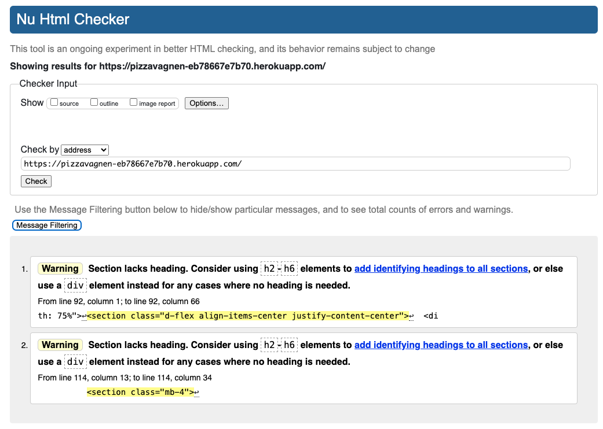

---

### CSS Validation

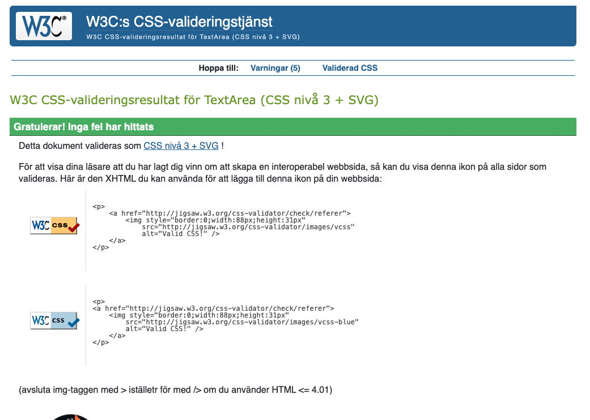

---

### Python Validation

#### Pizzavagnen (project)

##### Settings

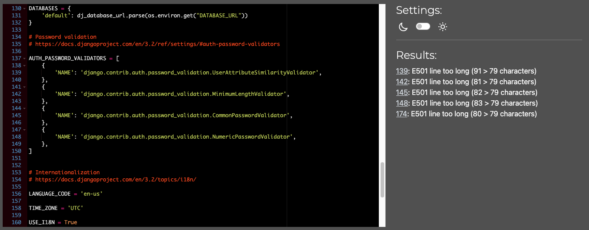

Don't know how to fix this.

#### User (app)

##### Models

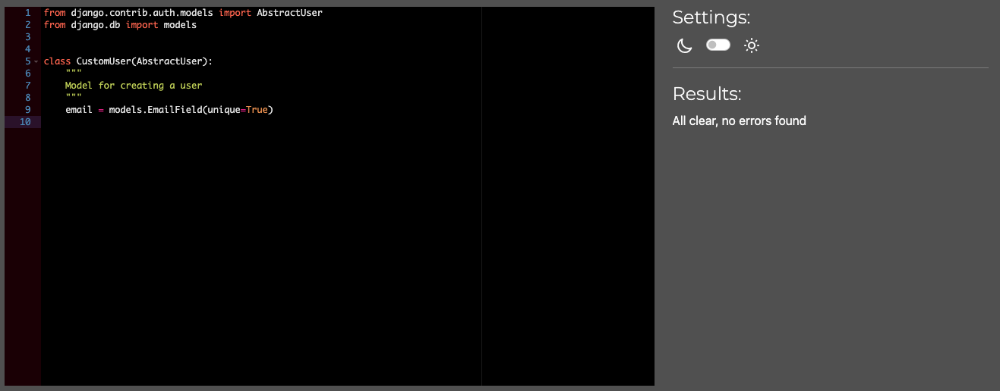

##### Views

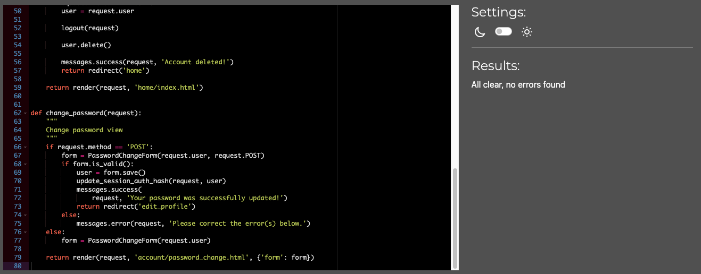

##### Forms

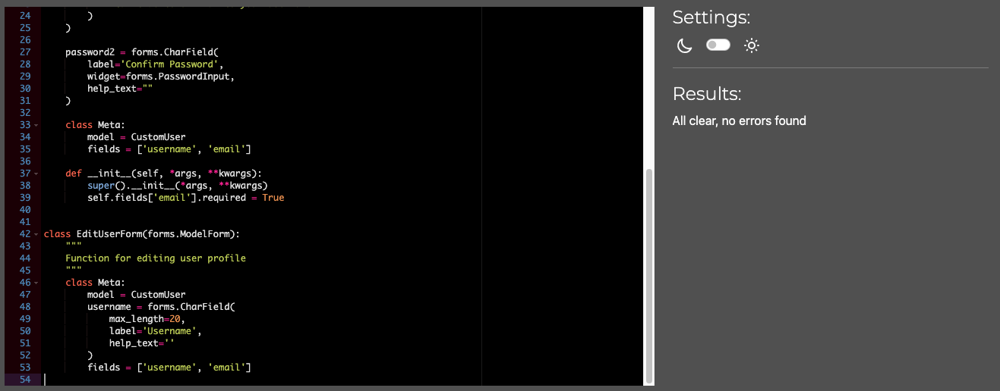

##### Admin

#### Review (app)

##### Models

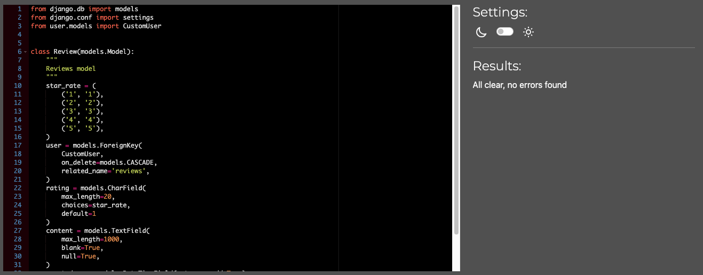

##### Views

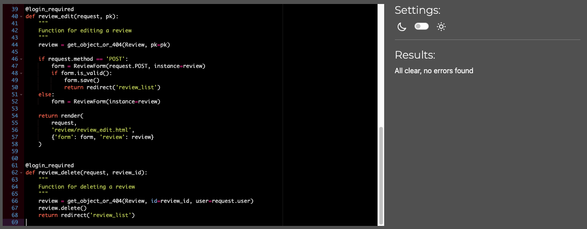

##### Forms

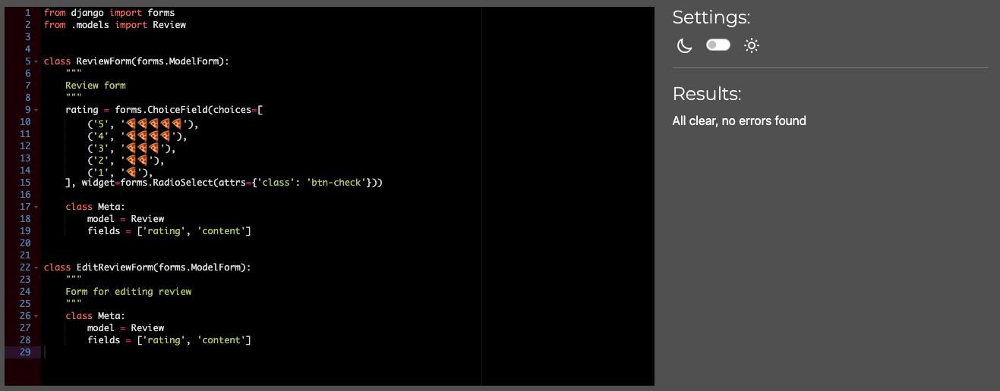

#### Events (app)

##### Models

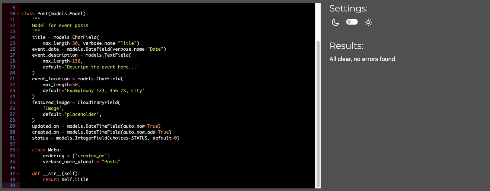

##### Views

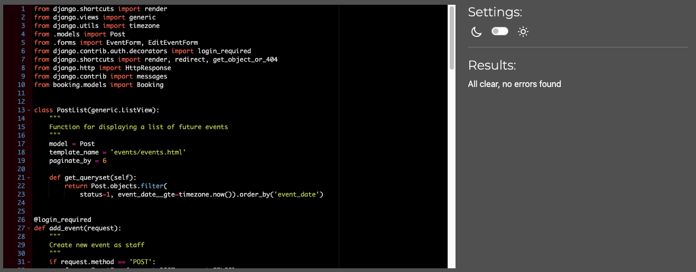

##### Forms

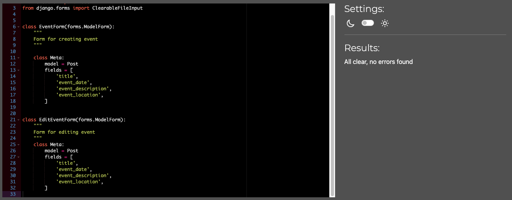

##### Admin

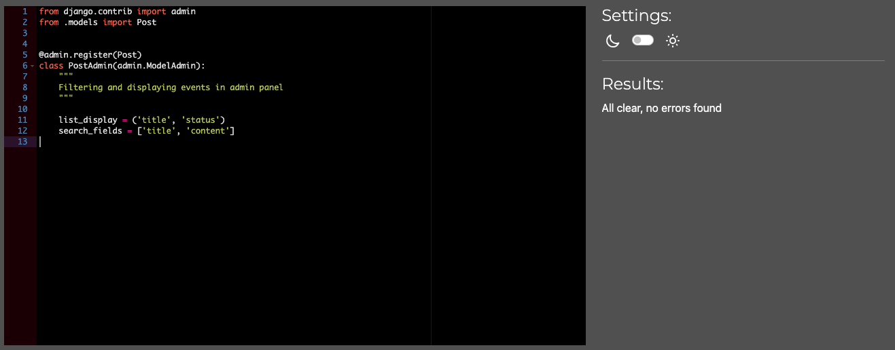

#### Booking (app)

##### Models

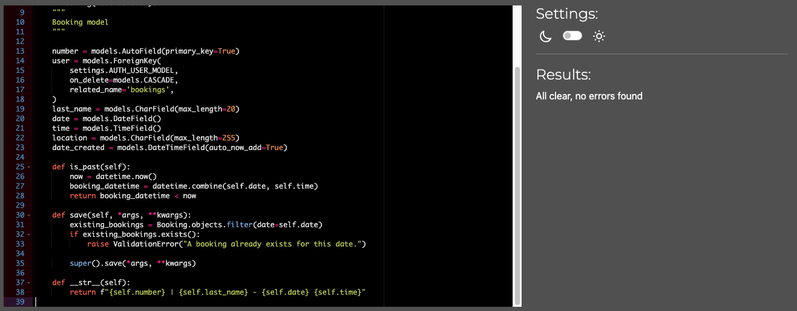

##### Views

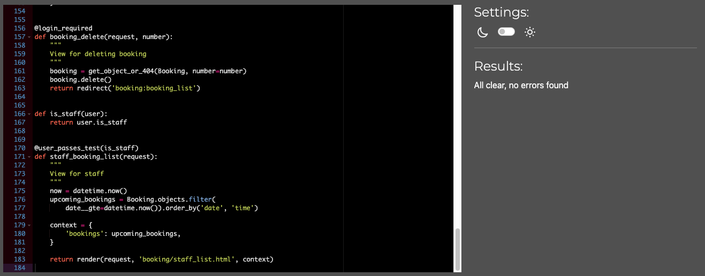

##### Forms

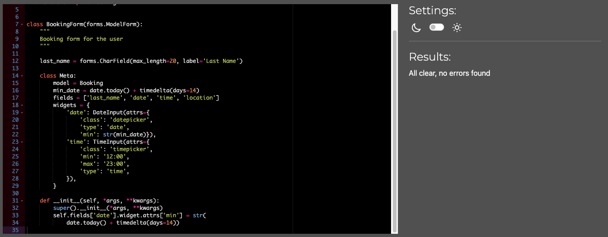

##### Admin

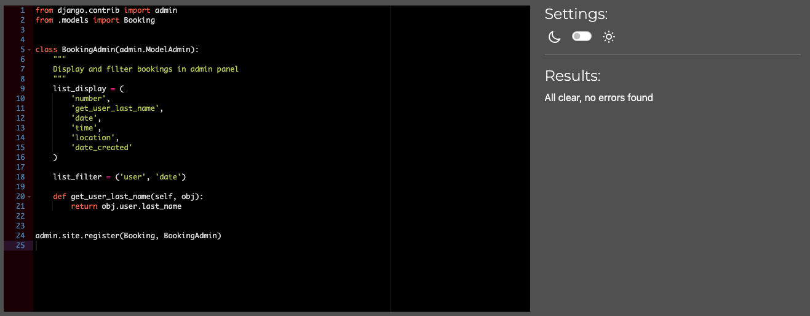